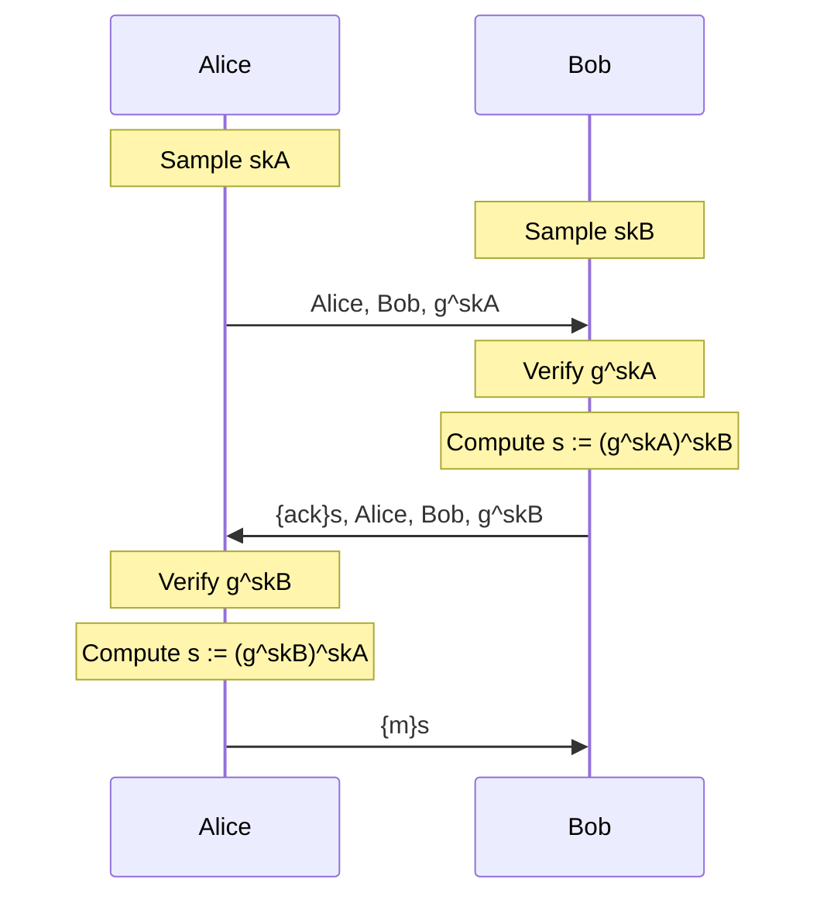

# Example 2

The goal of example 2 is to apply the Tamarin syntax from example 1 on a problem that we briefly discussed in class: Diffie-Hellman Protocol. Open `exADH.spthy` and follow the instructions inside.

## Ltk

The goal of this is very similar to the previous `KeyGen` rule we implemented. Try implementing this under the constraint of Diffie-Hellman.

## A_Init

The goal of this is for participant `A` to use its public value to send a request to participant `B` for its public key.

## B_Init

The goal of this is for participant `B` to verify `A`'s key and send back an acknowledgment to participant `A`.

## A_SendMsg

Th goal of this is for participant `A` to verify `B`'s key and send back the symmetrically encrypted message `msg`.

