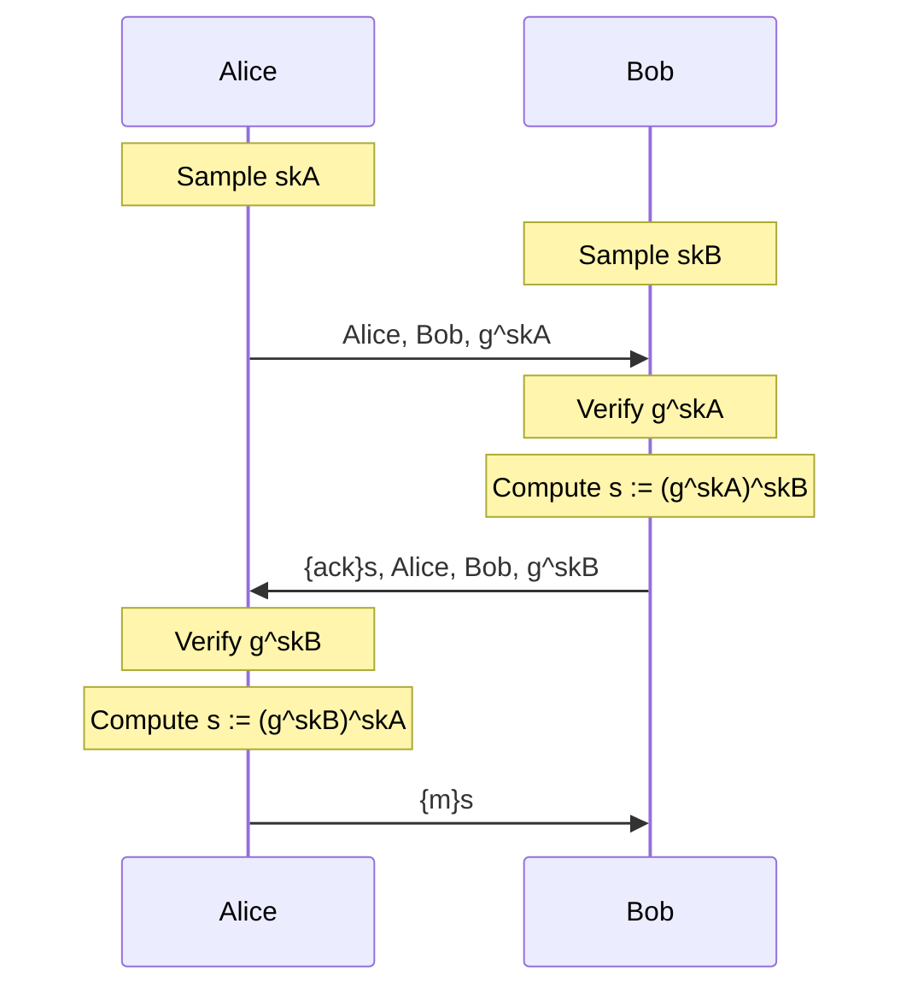

# Example 2

The goal of example 2 is to apply the Tamarin syntax from example 1 on a problem that we briefly discussed in class: Diffie-Hellman Protocol. Open `exADH.spthy` and follow the instructions inside.



## Ltk

The goal of this is very similar to the previous `KeyGen` rule we implemented. Try implementing this under the constraint of Diffie-Hellman.

## A_Init

The goal of this is for participant `A` to use its public value to send a request to participant `B` for its public key. The request should include `A`'s public value, `B`'s public value, and `A`'s public key. Note that in addition to sending the request, we also want to store `A`'s public value and `B`'s public value.

## B_Init

The goal of this is for participant `B` to verify `A`'s key and send back an acknowledgment to participant `A`.

The premise for this rule should take in participant `B`'s long term key, participant `A`'s public key, participant `B`'s public key, and participant `A`'s request from the previous rule.

The conclustion for this rule should output a symmetrically encrypted acknowledgement with the shared key, as well as participant `A`'s public value, participant `B`'s public value, and participant `B`'s public key.

## A_SendMsg

The goal of this is for participant `A` to verify `B`'s key and send back the symmetrically encrypted message `msg`.

The premise for this rule should take in participant `A`'s long term key, participant `B`'s public key, the encrypted acknowledgement, and the stored values from `A_Init`.

The conclustion for this rule should output the symmetrically encrypted message using the shared key.


## Lemma Writing

Let's try to understand the lemmas in `exADH.spthy`! The first lemma is `Executability`:

```tamarin
lemma Executability:
  exists-trace
  "Ex #t1 #t2 #t3. ReachAInit() @ #t1 & ReachBInit() @ #t2 & ReachASendMsg() @ #t3"
```

The executability lemma states that for some time points `#t1`, `#t2`, and `#t3`, `ReachAInit()` occurs at time `#t1` and `ReachBInit()` occurs at time `#t2` and `ReachASendMsg()` occurs at time `#t3`.

As an exercise, take a look at the three remaining lemmas and try to understand them. Write your interpretation of the lemmas in the problem set.


