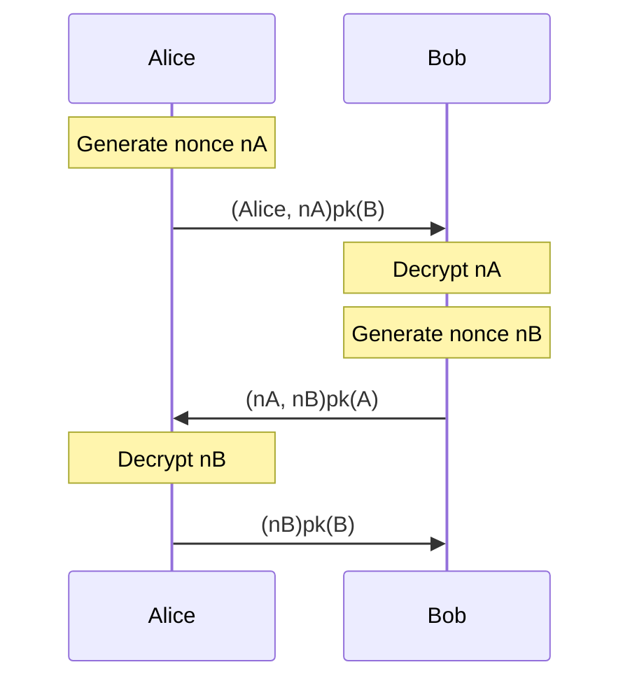
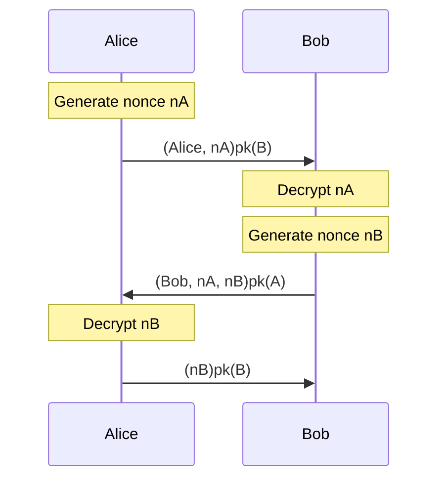

# Exercise 3

The goal of exercise 3 is to verify a more complex protocol with more sophisticated lemmas, including modeling man-in-the-middle attacks. We focus on the Needham-Schroeder protocol, a method to provide mutual authentication between two parties that was discussed in class. In particular, you will first show that the naive Needham-Schroeder protocol is insecure, and then show that the fix proposed by Lowe patches this insecurity. Open `NSInecure.spthy` and follow the instructions inside.

## Built-ins and Public Key Infrastructure

The begining of the file contains some initial scaffolding, importing the built-in `asymmetric-encryption` functions and defining basic rules to model the public key incfrastructure. Make sure you understand these before moving forward; while the `RegLtk` rule should be familiar by now, it differs slightly for asymmetric encryption, and `GetPk` and `RevLtk` are new. 

## Defining the Protocol

Next, fill in the details of rules `A1`, `B1`, `A2` and `B2`. Each rule has decreasing levels of guidance. Rule `A1` is provided in its entirety as an example. In rule `B1`, fill in every line by following the associated comment. In rule `A2`, only the action terms are provided; fill everything else in! Finally, complete rule `B2` from scratch, including the missing action terms.  

## Defining the Lemmas

After defining the protocol, you'll notice a lemma called `types`. This is a sources invariant designed to help the prover converge. Feel free to ignore it, but if you're feeling brave you can try figuring out what it does and why it is necessary! See what happens if you try proving the `nonce_secracy` lemma without it; this is not necessary for the exercise.

Next, look at the lemma `nonce_secracy`. This is very similar to the secracy lemmas in exercise 2; fill in the missing lines denoted by `...`. Note that, when implemented correctly, the protocol will fail to satisfy this lemma. This is precisely because of the man-in-the-middle attack discovered by Lowe! Look at the solution to the lemma and see if you can figure out where it goes wrong.

Next, the lemma `session_key_setup_possible` should check that it is possible to set up secrets between honest agents. This just verifies that our protocol is actually useful! The `exists-trace` keyword indicates that this lemma holds if there is any trace where the condition is satisfied, as opposed to other lemmas where we want the condition to hold over all traces. Complete the lemma. If done correctly the protocol should satisfy this lemma, since it is possible for agents to set up secrets even over the insecure protocol.

Finally, look at lemma `injective_agree` which has already been implemented for you. This lemma is a bit more complex, and captures the idea of injective agreement - every `Running` term should be paired with a unique `Commit` term. Add comments explaining what the components of the lemma do.

## Making Needham-Schroeder Secure

Let us verify that the fix proposed by Lowe makes the protocol secure against man-in-the-middle attacks! Open `NSSecure.spthy`, and start by copying the code from `NSInecure.spthy`. Next, make the necessary changes to the rules. 

Although the change is simple, you'll have to modify more than one rule! If done correctly, all the lemmas should now pass.