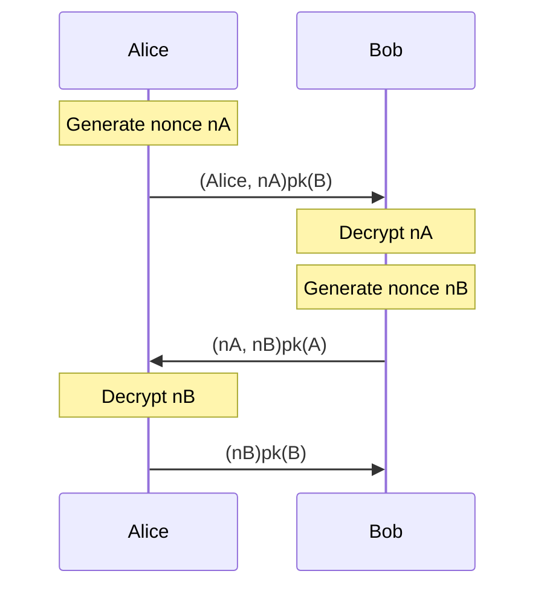

# Exercise 3

The goal of exercise 3 is to verify a more complex protocol with more sophisticated lemmas, including modeling man-in-the-middle attacks. We focus on the Needham-Schroeder protocol, a method to provide mutual authentication between two parties that was discussed in class. In particular, you will first show that the naive Needham-Schroeder protocol is insecure, and then show that the fix proposed by Lowe patches this insecurity. Open `NSSecure.spthy` and follow the instructions inside.

## Built-ins and Public Key Infrastructure

The begining of the file contains some initial scaffolding, importing the built-in `asymmetric-encryption` functions and defining basic rules to model the public key incfrastructure. Make sure you understand these before moving forward; while the `RegLtk` rule should be familiar by now, `GetPk` and `RevLtk` are new. 

## Defining the Protocol